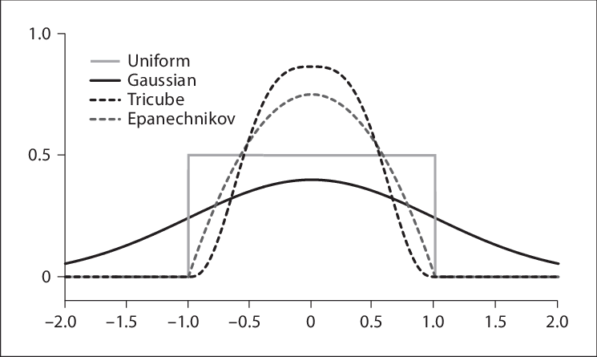

---
jupyter:
  jupytext:
    formats: ipynb,md
    text_representation:
      extension: .md
      format_name: markdown
      format_version: '1.1'
      jupytext_version: 1.2.4
  kernelspec:
    display_name: Julia 1.2.0
    language: julia
    name: julia-1.2
---

<style>
@media print
{
h2 {page-break-before:always}
}
</style>

# Homework 04

### Brown University  
### DATA 1010  
### Fall 2019


## Problem 1
 

Suppose that the probability density function for the random point where your dart hits the dartboard $D \subset \mathbb{R}^2$ is given by $$f(x,y) = \frac{1}{\pi} e^{-x^2 - y^2},$$ where the origin is situated at the dartboard’s bull’s eye, and where $x$ and $y$ are measured in inches (this function is positive everywhere in $\mathbb{R}^2$, so the "dartboard" includes the disk shown as well as the (infinite) wall it is mounted on—this is realistic insofar as one can indeed hit the wall with a dart throw). Find the probability of scoring triple 20 on your next throw. 

*(Optional)* Confirm your result using Monte-Carlo simulation.

**Note:** The triple 20 region is the smaller of the two thin red strips in the sector labeled “20”. The inner and outer radii of this thin strip are 3.85 inches and 4.2 inches, respectively. 


**Solution:**     
$
\begin{align*}
& \iint_A f(x,y) \,dx\,dy\\
& =\iint_A f(rcos(\theta),rsin(\theta))r \,dr\,d\theta\\
& = \iint_A \frac{e^{-r^2}}{\pi}r \,dr\,d\theta \\ 
& = 1.71744\cdot 10^{-8}
\end{align*}$    
where r $\in [3.85, 4.2]$ and $\theta \in [0,\frac{\pi}{10}]$


## Problem 2
  
Suppose that $X$ and $Y$ have joint PDF $f(x,y) = \frac{3}{2}y$ on the upper unit disk (that is, the set of points which have positive $y$-coordinate and are less than one unit from the origin).

1.  Verify that $f$ is indeed a probability density function.

2.  Find the density of the distribution of $X$.

3.  Find the conditional density of $Y$ given $X = x$.

4.  Find $\mathbb{E}[Y | X]$.


**Solution:**      
*1.*       
$\begin{align*}
& \iint_A f(x,y) \,dx\,dy \\
& = \int_0^\pi\int_0^1 \frac{3rsin(\theta)}{2}r \,dr\,d\theta \\
& = 1
\end{align*}$      
Thus, $f$ is indeed a probability density function.


*2.*      
$\begin{align*}
& \mathbf{P}(X = x) = \int_0^{\sqrt{1-x^2}}\frac{3y}{2} \,dy = \frac{3}{4}(1-x^2)
\end{align*}$


*3.*    
$\begin{align*}
& \mathbf{P}(Y|X = x) \\
& = \frac{f(x,y)}{\int_0^{\sqrt{1-x^2}}\frac{3y}{2} \,dy}\\
& = \frac{\frac{3}{2}y}{\frac{3}{4}(1-x^2)} \\
& = \frac{2y}{1-x^2}
\end{align*}$


*4.*    
$\begin{align*}
& \mathbb{E}[Y|X] = \int_0^{\sqrt{1-x^2}} y\frac{2y}{1-x^2}\,dy = \frac{2}{3}\sqrt{1-x^2}
\end{align*}$


## Problem 3

The *skewness* of a distribution $\nu$ is a measure of its asymmetry about its mean. It is defined to be
$$\mathbb{E}\left[\left(\frac{X-\mu}{\sigma}\right)^3\right],$$ where $X$ is a random variable with distribution $\nu$, $\mu$ is the mean of $X$, and $\sigma$ is the standard deviation of $X$. Find the skewness of the exponential distribution with parameter $1$. You should set up the integrals on your own, but feel free to evaluate them using a symbolic computation system.   


**Solution:**    
X has exponential distribution with $\lambda = 1$, thus $\mu = 1$ and $\sigma = 1$     
$\begin{align*}
& \mathbb{E}\left[\left(\frac{X-1}{1}\right)^3\right]\\
& = \int_0^\infty (x-1)^3 e^{-x}\,dx\\
& = 2
\end{align*}$

<!-- #region -->
## Problem 4

Let $X$ be the first digit of the number of residents of a randomly selected world city. What would you expect the distribution of $X$ to look like? What about the *last* digit $Y$?

Load the associated world city populations CSV as a DataFrame and check your predictions. Compare to the distribution with probability mass function
$$m(d) = \log_{10}(d+1) - \log_{10}(d) \quad \text{ for }d \in \{1,2,\ldots,9\}.$$

```julia
using StatsBase, Plots, FileIO, DataFrames
D = DataFrame(load("cities.csv"))
D[:Population]
tallydict = # you fill in this part
sticks(1:9,collect(values(tallydict)))
```
<!-- #endregion -->

**Solution:**     
Prediction: X should be uniformly distributed on {1,...,9}; and Y should be uniformly distributed on {0,...,9}

```julia
import Pkg; 
Pkg.add("FileIO")
Pkg.add("CSVFiles")
Pkg.add("Plots")
```

```julia
using StatsBase, Plots, FileIO, DataFrames
D = DataFrame(load("cities.csv"))
# print(size(D))
pop = D[!, :Population]
# println(length(pop))
# for the first digit
xdict = []

for i in pop
    while i >= 10
        i = i ÷ 10
    end
    push!(xdict, i)
end
# print(length(xdict))

tallxdict = countmap(xdict)
sticks(1:9, k -> tallxdict[k])
plot!(1:9, x -> ((log10(x+1) - log10(x)) * length(xdict)))
```

```julia
# for last digit
tallydict = countmap([i % 10 for i in D[!, :Population]])
sticks(0:9, k -> tallydict[k])
```

## Problem 5

A **call option** is a financial contract between two parties which grants the buyer the right, but not the obligation, to purchase a specified security at a specified price (called the **strike price**) at a specified date in the future (called the **expiration date**).

Suppose that you purchase a call option for $10$ shares of AAPL with a strike price of $\$216$ and an expiration $22$ business days from now. Suppose that the daily change in the price of AAPL is normally distributed with mean zero and standard deviation $\$8.44$, and that the changes for different days are independent.

(a) Find a function $f$ such that the call option is worth $f(P)$ dollars to you if the share price in 22 days is $P$. Draw a graph of $f$. Hint: if the price is greater than $\$216$, would you exercise the option and purchase the stock? What if it’s less than $\$216$?

(b) Find the distribution of $P$.

(c) Find the fair price of the call option, based on the above assumptions.

Notes: (1) the data in this problem are real: the current price at time of writing is $\$216$, and the daily fluctuations have had an empirical standard deviation of $\$8.44$ historically. The number of business days in a month is approximately $22$. (2) Although this problem uses finance ideas, all of the finance information you need to solve the problem is in the problem statement.

To help you with the symbolic integration, here's some code for finding the expected value of the Gaussian distribution centered at μ. 


**Solution:**    
*(a)*    
$f(P) = 10(P-216)$    
If the price is greater than 216, then we exercise the option and purchase the stock; if the price is less than 216, then do not exercise the option. 

```julia
f(P) = P>= 216 ? 10(P-216) : 0
plot([(x, f(x)) for x in 150:1:400])
```

*(b)*    
$P_1 = 216 + 8.44^2\\
P_2 = P_1 + 8.44^2\\
...\\
P_{22} = 216 + 22\cdot 8.44^2$    
Thus, the distribution of P is a normal distribution $\mathbf{N}(216,22\cdot8.44^2)$


*(c)*    
$\mathbb{E}(10(216-P)) = \int_{216}^\infty10(216-P)\cdot PDF(P)\\
= 157.9
$

```julia
using SymPy
@vars P σ μ positive=true
μ = 216
σ = sqrt(22*8.44^2)
I = integrate((10P-2160)*1/sqrt(2*PI*σ^2)*exp(-(P-μ)^2/(2σ^2)),(P,216,oo))
float(I)
```

## Problem 6

Consider two random variables $X$ and $Y$ whose joint distribution has probability mass of $\frac{1}{n}$ at each of the $n$ points
$\{(x_1, y_1), \ldots, (x_n,y_n)\}$ in $\mathbb{R}^2$. Show that the covariance matrix of $X$ and $Y$ is equal to
  $$
    \frac{1}{n}\sum_{i=1}^{n}\left[\begin{smallmatrix}x_i-\overline{x}
        \\
        y_i-\overline{y}\end{smallmatrix}\right]\left[\begin{smallmatrix}
        x_i-\overline{x}
    \quad y_i-\overline{y}\end{smallmatrix} \right]. 
  $$
where $\overline{x} = (x_1+\cdots+x_n)/n$ and  $\overline{y} = (y_1+\cdots+y_n)/n$. 


**Solution:**(For some unknown reason, the Latex code of this problem is not properly shown in the PDF, so I attach a screenshot of the output of the code at the end of the solution just in case the Latex code is not shown again.)    
The covariance matrix of $X$ and $Y$ is
$$\begin{bmatrix}
    cov(X,X)& cov(X,Y) \\
    cov(Y,X)&cov(Y,Y)
\end{bmatrix}\\
= \begin{bmatrix}
    \mathbb{E}[(x-\overline{x})^2] & \mathbb{E}[(x-\overline{x})(y-\overline{y})] \\
    \mathbb{E}[(y-\overline{y})(x-\overline{x})] & \mathbb{E}[(y-\overline{y})^2]
\end{bmatrix}\\
=\begin{bmatrix}
    \frac{1}{n}\sum_{i=1}^{n}(x_i-\overline{x})^2 & \frac{1}{n}\sum_{i=1}^{n}(x_i-\overline{x})(y_i-\overline{y})\\
    \frac{1}{n}\sum_{i=1}^{n}(y_i-\overline{y})(x_i-\overline{x}) & \frac{1}{n}\sum_{i=1}^{n}(y_i-\overline{y})^2
\end{bmatrix}\\
=
\frac{1}{n}\sum_{i=1}^{n}\left[\begin{smallmatrix}x_i-\overline{x}
        \\
        y_i-\overline{y}\end{smallmatrix}\right]\left[\begin{smallmatrix}
        x_i-\overline{x}
    \quad y_i-\overline{y}\end{smallmatrix} \right]
$$   
   


## Problem 7

The *Epanechnikov* kernel is defined by
$$
    D(u) = \frac{3}{4}(1-u^2)\boldsymbol{1}_{|u| \leq 1}. 
$$
* Is $D$ continuous? Is it differentiable? Is it twice differentiable?
* Is the tri-cube weight function continuous? Is it differentiable? Is it twice differentiable? 
  
Feel free to use SymPy to perform the symbolic differentiation in this problem. 


**Solution:**     
    
*1a.*    
Since $\lim_{u\to -1^{-}} D(u) = \lim_{u\to -1} D(u) = \lim_{u\to -1^{+}} D(u) = 0$, and $\lim_{u\to 1^{-}} D(u) = \lim_{u\to 1} D(u) = \lim_{u\to 1^{+}} D(u) = 0$, thus $D$ is continuous.   
*1b.*     
$\begin{align*}
& \lim_{\Delta h \to 0} \frac{D(x+\Delta h) - D(x)}{\Delta h} \\
& = \lim_{\Delta h \to 0} \frac{\frac{3}{4}[(1-(u+\Delta h)^2)-(1-u^2)]}{\Delta h}\\
& = \lim_{\Delta h \to 0} -\frac{3}{4}(2u + \Delta h)\\
& = -\frac{3u}{2}
\end{align*}$      
When $u = -1$, the differentiation of $D(u)$ is 0 from the left side and $\frac{3}{2}$ from the right side, thus $D$ is undifferentiable.      
*1c.*    
Since $D$ is not differentiable, it is also not twice differentiable.


2a.     
Similarly, for tricube weight function, $T(u) = \frac{70}{81}(1-|u|^3)^3$, the limit at $u = -1$ from the left side is $0$ and the limit from the right side is $0$, thus it is continuous at point $x = -1$; same for the point $x = 1$, the limit from left side and right side are both $0$, thus the tricube weight function is continuous.         
2b.      
Take differentiation of the Tricube weight function, we get $T^{'} = -\frac{70}{9}u|u|(1-|u|^3)^2$. We approache the point$u = -1$ from the left side and $T^{-1}$ from the left side is 0, from rhe right side is also 0. Thus $u = 01$. Same for $u = 1$, the differentiation from the left approache and the right approcahe are both 0, thus also differentiable at $u = 1$. Thus, the Tricube weight function is differentiable.     
2c.     
Similarly, the twice differentiation of $T(u)$ is $T^{''}(u) = -\frac{140x^2(4x^6-6x^2|x|+|x|^3+1)}{9|x|}$, the limit at $u = -1$ from the left side is $0$ and the limit from the right side is also $0$, thus it is twice differentiable at $u = -1$; same for $u = 1$, the limit of $T^{''}(u)$ from the left side and the right side are both $0$, so it is also twice differentiable when $u = 1$. Thus, $T(u)$ is twice differentiable.


## Problem 8

Simulate $n = 1000$ samples from the joint distribution of $X$ and $Y$, given that $X$ is uniform on $[0,1]$ and $Y = 2 + 1.2X + \epsilon$, where $\epsilon \sim \mathcal{N}(0,0.5)$. Record the integrated squared error for the Nadaraya-Watson estimator (with bandwidth selected by cross-validation) and for the line of best fit.

Notes: (1) You can approximate the integrated squared difference between two functions by evaluating the squared difference at the points of a fine-mesh grid. And (2) you'll have to write code for simulating from the joint distribution of $X$ and $Y$, but then the Nadara-Watson part you can mostly get from Data Gymnasia.


```julia
using LinearAlgebra, Statistics, Roots, Optim, Plots, Random, Distributions
Random.seed!(1234)
n = 1000 # number of samples to draw

# the true regression function
# r(x) = 2 + 1/50*x*(30-x)
# the true density function
# σy = 3/2  
# f(x,y) = 3/4000 * 1/√(2π*σy^2) * x*(20-x)*exp(-1/(2σy^2)*(y-r(x))^2)

# x values and y values for a grid
xs = 0:0.1:1
ys = 0:0.1:6


"Sample from joint distribution of X and Y"
function sampleXY()
    X = rand(Uniform(0,1))
    Y = 2 + 1.2(X) + rand(Normal(0,0.5))
    (X,Y)
end

# Sample n observations
samples = [sampleXY() for i=1:n]

D2(u) = abs(u) < 1 ? 70/81*(1-abs(u)^3)^3 : 0 # tri-cube function
D2(λ,u) = 1/λ*D2(u/λ) # scaled tri-cube
K(λ,x,y) = D2(λ,x) * D2(λ,y) # kernel
kde(λ,x,y,samples) = sum(K(λ,x-Xi,y-Yi) for (Xi,Yi) in samples)/length(samples)


# `optimize` takes functions which accept vector arguments, so we treat
# λ as a one-entry vector
# L(λ) = sum((f(x,y) - kde(λ,x,y,samples))^2 for x=xs,y=ys)*step(xs)*step(ys)

# minimize L using the BFGS method
# λ_best = optimize(λ->L(first(λ)),[1.0],BFGS())

"Evaluate the summation Σᵢ f⁽⁻ⁱ⁾(Xᵢ,Yᵢ) in J(λ)'s second term"
function kdeCV(λ,i,samples)
    x,y = samples[i]
    newsamples = copy(samples)
    deleteat!(newsamples,i)
    kde(λ,x,y,newsamples)
end

# first line approximates ∫f̂², the second line approximates -(2/n)∫f̂f
J(λ) = sum([kde(λ,x,y,samples)^2 for x=xs,y=ys])*step(xs)*step(ys) -
        2/length(samples)*sum(kdeCV(λ,i,samples) for i=1:length(samples))
λ_best_cv = optimize(λ->J(first(λ)),[1.0],BFGS())
print(λ_best_cv)
λ = first(λ_best_cv.minimizer)
r̂(x) = sum(D2(λ,x-Xi)*Yi for (Xi,Yi) in samples)/sum(D2(λ,x-Xi) for (Xi,Yi) in samples)
pyplot()
plot(0:0.2:1.4, r̂, label = "Nadaraya-Watson estimator", ylims = (0,4))
```

```julia
f(x) = 2+1.2x #True function
itgrSE = sum((r̂(x) - f(x))^2 for x in xs)
```

## Problem 9

* Find the variance of the uniform distribution on the interval $[0,10]$.
* Generate 10 independent samples from the uniform distribution, calculate the average $\overline{X}$ for those samples, and estimate the variance as $\widehat{V} = \frac{1}{10}\sum_{i=1}^{10} (X_i-\overline{X})^2$. Package this whole process as a function, and call it a million times to find the mean of $\widehat{V}$.
* Which is larger, the answer to (a) or the answer to (b)? Calculate the percent error. 


<!-- #region -->
**Solution:**    
a. The variance of the uniform distribution on the interval $[0,10]$ is $\frac{10^2-0^2}{12} = \frac{25}{3}$     
b. By code,   
```julia
function get_mean()
    sample = rand(Uniform(0,10),10)
    mean = sum(sample)/ 10
    var = sum([(i - mean)^2 for i in sample])/10
end

b = sum([get_mean() for n in 1:1000000])/1000000
```
we get b            
c. 
Use 100|a-b|/a we can get the percent error.
<!-- #endregion -->

```julia
function get_mean()
    sample = rand(Uniform(0,10),10)
    mean = sum(sample)/ 10
    var = sum([(i - mean)^2 for i in sample])/10
end
a = 25/3
b = sum([get_mean() for n in 1:1000000])/1000000
```

```julia
100*abs(a - b)/a
```

## Problem 10

The Student’s *t*-distribution with parameter $ν$ is the distribution of the random variable

$$\frac{\bar{X}_{n} - \mu}{S_{n}/\sqrt{n}}$$

where $n = ν + 1$, where $X_{1},...,X{n}$ is a sequence of independent $N(\mu,\sigma^{2})$’s, where $\bar{X} = \frac1n (X_{1} + ... + X_{n})$, and where $S_{n} = \sqrt{\frac{1}{n-1}\sum_{i=1}^{n}(X_{i} - \bar{X}_{n})^{2}}$

Estimate the variance of the Student’s *t*-distribution with parameter $ν = 10$ by using the above description to sample
from it $M$ times for some large $M$. Then compute the variance of the distribution which places probability mass $1/M$
at each of the simulated samples.

Look up the exact formula for the variance of the Student’s *t*-distribution on Wikipedia and check that your result is
close to the true value.


```julia
using Distributions, Statistics
function get_t()
    u = 0
    σ = 1
    X = rand(Normal(u,σ^2),11)
    mean = sum(X)/11
    s_n = sqrt(sum([(x - mean)^2 for x in X])/10)
    t = (mean - u)/(s_n/sqrt(11))
end
function get_v()
    time = 1000000
    sample = [get_t() for j in 1:time]
    avg = mean(sample)
    v = []
    for s in sample
        push!(v,(s-avg)^2)
    end
    V = sum(v)/time
end

get_v()
```

Based on Wikipedia, the variance of the Student’s *t*-distribution is $\frac{ν}{ν-2}$ for $ν > 2$, which is $\frac{10}{8} = 1.25$
